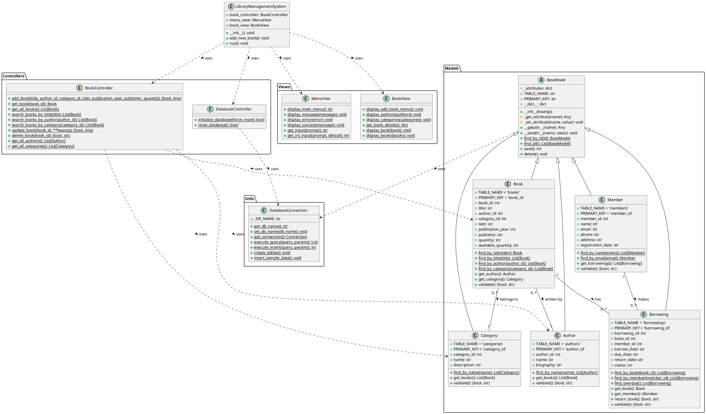
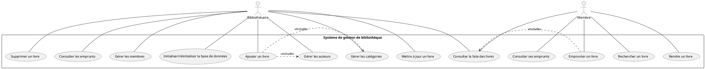

# UML Diagrams for Library Management System

## Class Diagram

## Package Diagram

## Use Case Diagram

## Explanation

### MVC Architecture

The Library Management System follows the Model-View-Controller (MVC) architectural pattern:

1. **Models**: Represent the data and business logic of the application
   - BaseModel: Abstract base class for all models
   - Book, Author, Category, Member, Borrowing: Domain-specific models

2. **Views**: Handle the presentation and user interface
   - MenuView: Displays menus and handles general user input
   - BookView: Handles book-specific display and input

3. **Controllers**: Mediate between models and views
   - BookController: Handles book-related operations
   - DatabaseController: Manages database initialization and reset

4. **Utils**: Provides utility functionality
   - DatabaseConnection: Handles low-level database operations

5. **Main Application**: Coordinates the overall application flow
   - LibraryManagementSystem: Main application class that ties everything together

### Key Relationships

- **Inheritance**: All model classes inherit from BaseModel, which provides common functionality for database operations and attribute management.

- **Associations**:
  - Books are written by Authors (many-to-one)
  - Books belong to Categories (many-to-one)
  - Books can be borrowed by Members through Borrowings (many-to-many)

- **Dependencies**:
  - Models depend on DatabaseConnection for database operations
  - Controllers depend on Models for data access and manipulation
  - The main application depends on Controllers and Views to implement functionality

### Encapsulation

All classes implement proper encapsulation:
- Model classes use private attributes with getters and setters
- Controllers provide a clean API for operations on models
- Views handle user interaction without exposing implementation details

This UML diagram provides a comprehensive overview of the Library Management System's architecture, showing the relationships between classes and the overall structure of the application.